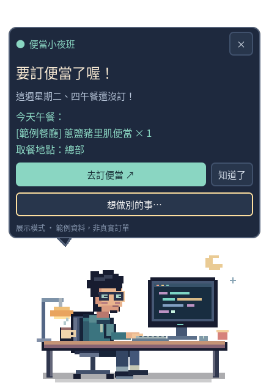

# 便當小夜班 · Bento Buddy

用 Godot 製作的透明桌面精靈：主動用對話氣泡提醒本週漏訂午餐、告訴你今天吃什麼。點人物可以查詢、設定或換角色。Windows / Linux 共用同一份程式。



## 開始使用

需要 **Python 3.10+**。原始碼版另需 **Godot 4.4+ 標準版**（不用 .NET）；發行資料夾若已有 `bin/bento-buddy` 或 `bin/bento-buddy.exe`，不需要另裝 Godot。

### Windows

1. 安裝 Python（[官方下載](https://www.python.org/downloads/)）及 [Godot](https://godotengine.org/download/windows/)。
2. 執行 `setup-windows.bat`，安裝本機查詢工具及 Chromium。
3. 若用原始碼版，把 Godot 加到 PATH，或在命令提示字元設定：

   ```bat
   set "GODOT_BIN=C:\Tools\Godot\Godot.exe"
   start-windows.bat
   ```

   有 `bin` 的發行資料夾直接執行 `start-windows.bat`。
4. 啟動就會自動嘗試沿用登入狀態；需要登入時會自動開啟專用瀏覽器，Windows 優先使用已安裝的 Edge。公司 SSO 若能自動完成，就不需要操作；第一次選帳號、輸入密碼或 MFA 仍由你完成。登入成功會關閉登入視窗並開始檢查，之後啟動優先在背景直接使用已保存的登入狀態。

### Linux

```bash
./setup-linux.sh
./start-linux.sh
```

Godot 不在 PATH 時：`GODOT_BIN=/完整路徑/godot ./start-linux.sh`。
若系統缺少 venv，先安裝發行版的 `python3-venv`。Chromium 若提示缺少系統套件，依 Playwright 的提示執行 `.venv/bin/python -m playwright install-deps chromium`。

透明、置頂及指定視窗位置需要桌面環境支援。Linux 建議 X11 + compositor；Wayland 的置頂／定位／點擊穿透限制因桌面環境而異。必要時可用 `GODOT_BIN` 指向以 `--display-driver x11` 執行 Godot 的 wrapper。Linux 實際測試環境為 Godot 4.7.1 / X11；Windows 尚待實機驗證。

### 只看造型，不連線

```bash
godot --path . -- --demo
# 或在安裝後：
./start-linux.sh --demo
# Windows：start-windows.bat --demo
```

展示模式固定用範例資料，明確標示「非真實訂單」。安裝腳本執行過一次後，在 Godot 編輯器直接執行主場景（F6/F5），或開啟發行資料夾中的執行檔，也會自動啟動背景查詢，不必另外執行啟動腳本。關閉 Godot 後查詢工具會自動結束。

## 怎麼提醒

登入跳轉流程：啟動 → 訂餐首頁 → Microsoft 公司 SSO（需要時）→ 自動回到訂餐頁 → 精靈讀取預約並關閉登入視窗。不需要複製網址、Cookie 或手動按「登入完成」。

- 預設檢查本週週一～週五，可切換下週；週別會記住。
- 日期以 **台北時間 UTC+8** 計算，只看「午餐」，任一地點的有效午餐預約都算已訂。晚餐不算。
- 每 5 分鐘讀取 FoodCourt 首頁的「已預約清單」及可預約日期；不會替你下單、修改或取消。
- 尚未登入／登入過期時會自動開啟登入瀏覽器。若取消或驗證未完成，不會一直重開視窗，可按「登入」重試。
- 日期在網站的可預約選單內、尚未過期、又沒有午餐預約時，顯示「要訂便當了喔！星期 X 午餐還沒訂」。多天會一併列出。
- 日期沒列在網站上時顯示「待確認」，不會自行假設是漏訂或假日。請假／不用訂餐日尚無個別排除設定。
- 登入失效、網路錯誤、網站格式改變、跨日或資料超過 15 分鐘，都不以舊資料發出漏訂提醒。
- 啟動取得資料時會先彈出氣泡，包含本週漏訂日與今天的餐點／取餐地點。
- 預設每天台北時間 11:00 提醒今天午餐（11:00～13:59 開啟或重新連線時補提醒一次）。設定可關閉。
- 自動氣泡約 25 秒收起；按「知道了」也能收起。仍漏訂時預設 30 分鐘後再提醒，設定可改成 15／30／60 分鐘或關閉漏訂提醒。
- 正在操作選單或設定時不會被通知切走；今天沒有確認的預約，就不會編造菜單。

## 操作

| 操作 | 效果 |
| --- | --- |
| 點人物 | 出現「想要我幫你做什麼？」選單 |
| 拖曳人物 | 移動桌面精靈 |
| 右鍵人物／知道了 | 收起氣泡；隱藏時右鍵會打開選單 |
| 今天吃什麼 | 顯示今日已訂午餐內容與取餐地點 |
| 這週漏訂哪天 | 顯示所選週別的週一～週五狀態 |
| 提醒設定 | 通知開關、提醒間隔、本週／下週、登入及立即檢查 |
| 更換人物 | 阿夜（工程師）、小紫（長髮女生）、小栗（短髮女生）或自訂 PNG |
| 去訂便當 | 用預設瀏覽器開啟訂餐系統 |
| ×／結束精靈 | 關閉精靈及查詢工具 |
| Tab / Shift+Tab / Enter | 導覽並操作對話框按鈕 |

目前需手動啟動，未安裝開機自啟或系統服務。關閉精靈後就不會提醒。

自訂人物接受 10 MB、4096 × 4096 以內的 PNG，建議使用透明背景。圖片會複製到 Godot 的 `user://custom_pet.png`，原圖搬走也不影響角色。人物、通知開關與間隔都會保存。

## 本機資料

不儲存密碼；登入 Cookies／瀏覽器設定只放在使用者的本機資料夾，不會進專案 Git。不要分享該資料夾。

- Windows：`%LOCALAPPDATA%\BentoBuddy`
- Linux：`${XDG_DATA_HOME:-~/.local/share}/bento-buddy`

`state.json` 儲存日期、已訂／未訂狀態、今天的餐點與取餐地點，以及查詢時間；`auth.json` 與 `browser-profile/` 儲存登入工作階段。登出／清除本機登入：先關閉精靈，再移除 `auth.json` 及 `browser-profile/`。程式不會讀取日常 Chrome 的個人設定檔；即使原本瀏覽器已登入，精靈的專用設定檔第一次仍可能需要驗證。自動登入不會繞過公司 MFA 或存取限制。

UI 偏好另存於 Godot 的 `user://settings.cfg`。目前不包含跨裝置同步。

## 開發與驗證

```bash
python3 -m unittest discover -s tests -v
godot --headless --editor --path . --import --quit
godot --headless --path . --script tests/ui_smoke.gd
godot --path . -- --demo --capture   # output/preview.png，需要圖形環境
# 已啟動虛擬螢幕 :90 時：
DISPLAY=:90 godot --display-driver x11 --path . --script tests/preview_views.gd
DISPLAY=:90 XDG_DATA_HOME="$PWD/output/test90-data" godot --display-driver x11 --path . --script tests/interaction.gd
BENTO_TEST_DISPLAY=:90 python3 -m unittest discover -s tests -p 'test_godot_bootstrap.py' -v
```

`companion/orders.py` 依實際觀察到的 FoodCourt 欄位解析；測試資料是合成餐點。登入後的背景自動查詢仍須在使用者完成精靈專用登入後驗證，公司 SSO 原則可能限制自動化瀏覽器。

安裝與 Godot 版本相同的官方 Export Templates 後，執行 `python3 scripts/build.py`，產生 `build/linux` 及 `build/windows`。發行時分享整個資料夾；執行檔會自動啟動旁邊的 `bridge_runner.py`，網站功能仍需先執行 setup 安裝 Python 套件。Windows 圖示與程式簽章尚未配置。

## 檔案

- `scripts/main.gd`：透明視窗、對話、狀態顯示、稍後提醒。
- `scripts/pixel_engineer.gd`：原創靜態像素角色，以 Godot 方格繪圖，不需外部圖片服務。
- `companion/bridge.py`：專用 Chromium 登入、唯讀查詢、本機檔案 IPC。
- `companion/orders.py`：日期、週別與預約解析。
- `run.py`：跨平台啟動、單一執行個體及生命週期管理。
- `bridge_runner.py`：Godot 直接啟動時使用的背景查詢入口，會跟隨 Godot 結束。

字體是 Noto Sans CJK TC 的子集，授權見 `assets/fonts/LICENSE.txt`。修改文案後可安裝 `fonttools`，執行 `scripts/subset_font.py /path/to/NotoSansCJK-Regular.ttc` 重新產生字形。
